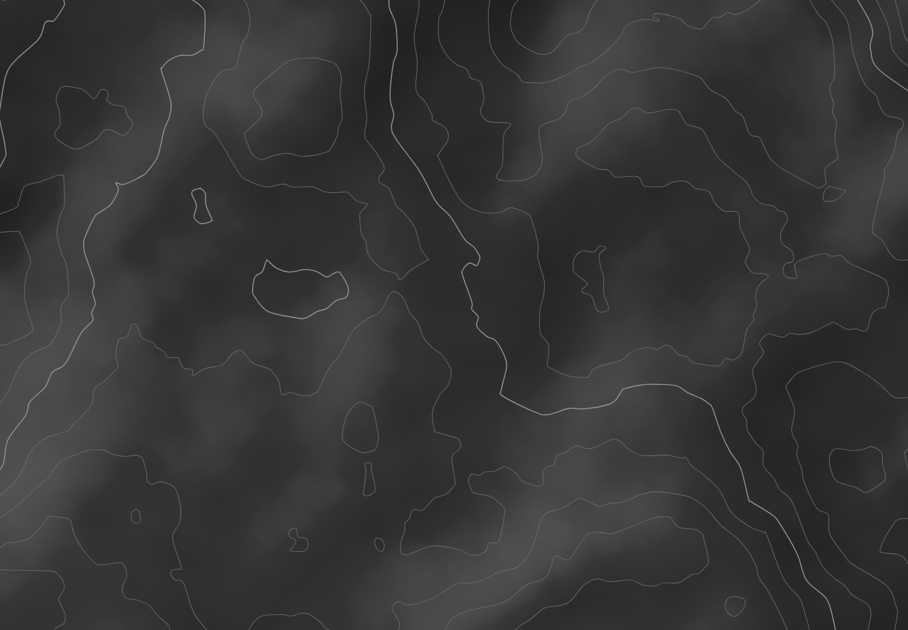
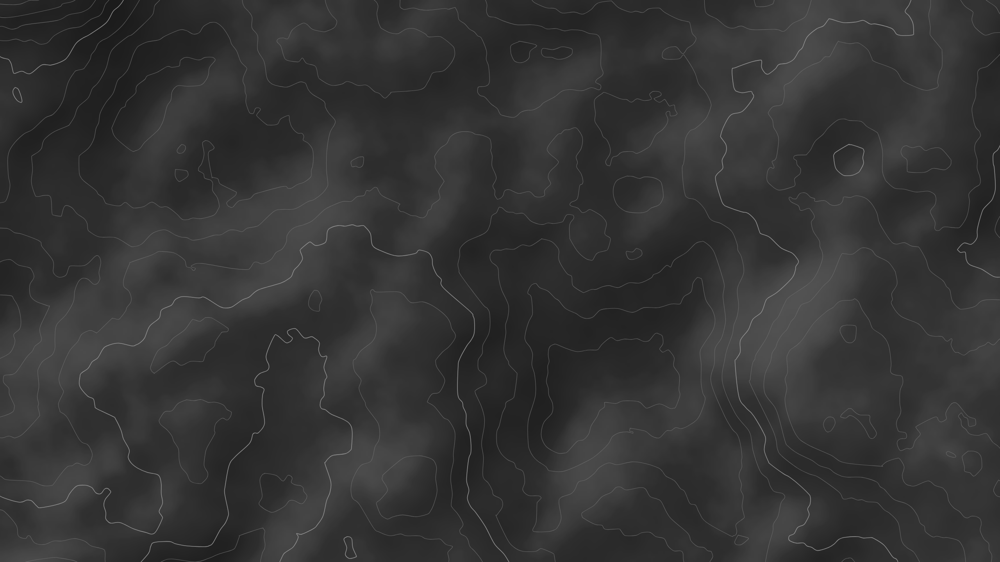
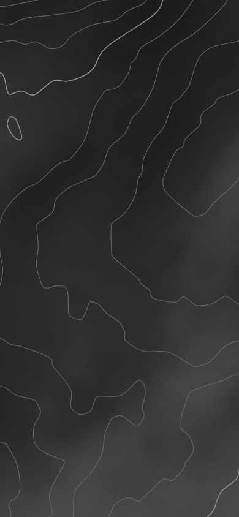
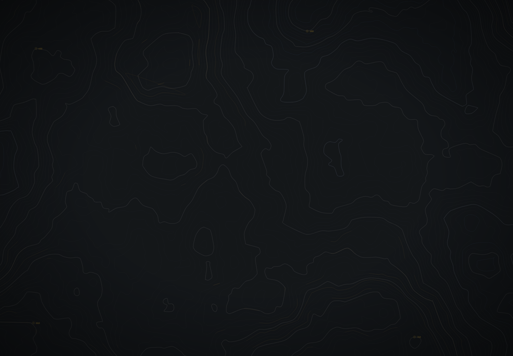

# 舆图 · hypsa-isopleth

**零依赖的程序化地形底纹生成器。** 自写值噪声 fBm 高度场 + marching squares 等值线（*isopleth*）+ 分层设色色带（*hypsometric*）+ 单向光照与水面，输出 SVG。

名字来自两个制图学术语：**hypsometric**（分层设色，本项目用来做色带）与 **isopleth**（等值线，本项目用来做等高线）。



<sub>1440×1000 · 默认风格 <code>survey</code>：中性深底 + 9 条等高线 + 柔和单向明暗 · 全部由 <code>seed</code> 决定</sub>

| 2560×1440 | 390×844 | 分层方案（`atlas`） |
|---|---|---|
|  |  |  |

> **灵感来源**：工业/科幻风格的测绘界面与分层设色地形图的通用做法。
> 本项目不含任何游戏商标，模块名 / 类名 / 包名 / SVG 属性里都不会出现厂商名称；未使用任何游戏素材。

## 特性

- **零依赖**：噪声、marching squares、Douglas-Peucker、Catmull-Rom、山体阴影、PNG 编解码全部自写，只用 Node / 浏览器标准 API
- **确定性**：同 `(seed, 尺寸, 参数)` 必得逐字节相同的 SVG，可用哈希做回归闸门
- **平台无关**：生成核心不碰宿主 API；PNG 编码器由调用方注入（Node 走 `zlib`，浏览器走 `CompressionStream`）
- **任意宽高比铺满**：世界坐标连续采样，无平铺、无接缝；窄视口用确定性取景保证地形起伏
- **无动画**：静态产物，`prefers-reduced-motion` 天然满足

## 快速开始

```bash
# 一条命令出图（无需安装：直接跑 bin）
node bin/hypsa-isopleth.mjs --seed ridge-07 --size 1440x1000 > terrain.svg
node bin/hypsa-isopleth.mjs --style survey --size 2560x1440 --out hero.svg
node bin/hypsa-isopleth.mjs --style none --bands 0 --report    # 只要等高线

# 分层方案（主线/辅线/属性线/断裂/标注 + 叠加材质）
node steps/step6-atlas.mjs --size 1440x1000 --cards "120,700,420,220"

# 测试与基准（零依赖，不需要 npm install）
npm test
node tools/bench.mjs 1600 1000 9 7 5 1
```

```js
// 当库用（Node，同步）
import { generateTerrainSvg } from 'hypsa-isopleth/node';
const { svg, timings, stats } = generateTerrainSvg({ width: 1440, height: 1000, seed: 'isopleth-01' });
```

```js
// 浏览器（原生 ESM，异步：PNG 走 CompressionStream）
import { createTerrainTexture } from 'hypsa-isopleth/browser';
const svg = await createTerrainTexture({ width: 1440, height: 1000, seed: 'isopleth-01' });
document.body.style.backgroundImage = `url("data:image/svg+xml;charset=utf-8,${encodeURIComponent(svg)}")`;
```

`npm run serve:demo` 起本地静态服务器打开 `examples/demo.html` 可看完整交互（原生 ESM，无打包器）。

## 四种出图模式

| 模式 | 命令 | 说明 |
|---|---|---|
| **完整地形** | `steps/step4.mjs` | 色带 + 光照 + 水面 + 等高线 |
| **风格预设** | `steps/step5-style.mjs` | 结构与皮肤分离，三套预设一键切换 |
| **分层方案** | `steps/step6-atlas.mjs` | 主线/辅线/属性线/断裂/标注 + 噪点/扫描线/渐变 |
| **库 / CLI** | `bin/hypsa-isopleth.mjs` | 一条命令出图，可进 CI |

## 风格预设（`src/style.mjs`）

结构（几级色带、几条线、间距）与皮肤（底色、线色、线对比、明暗）是分开的，可以独立替换。

| 预设 | 底色 | 等高线 | 线比底亮 |
|---|---|---|---|
| `spec` | `#14171a` 偏冷 | `#8ea79a` @14% | +16 |
| **`survey`** | `#2b2b2b` 中性 | `#6a6a6a` @95% | **+44** |
| `survey-water` | `#2b2b2b` | `#6a6a6a` @95% + 水系青蓝 | +45 |

`survey` 的取值是从风格参考图里**只提取地纹语言**反推的。参考图里的白色地图块、水系线、状态高亮都是游戏内容，不属于地纹语言，一律没有抄。

## 分层方案（`src/atlas.mjs`）

| 层 | 参数 |
|---|---|
| 1 主线 | 1.5px `#4A4A4A` 35%，每 5 条一条（计曲线） |
| 2 辅线 | 0.75px `#3A3A3A` 20% |
| 3 属性线 | 0.5px 暖 `#C4912B` 18% 滤色（高且陡的段）/ 冷 `#2E5EAA` 15% 叠加（低洼段），**逐段局部出现** |
| 4 断裂 | 卡片区域内压到 3~5%，边缘高斯羽化（需传入卡片矩形） |
| 5 标注 | 0.5px 圆环 + 实心点 `#D4A833` 50%，旁挂等高程数值 |
| 叠加 | 白色噪点 2% 柔光 + 1px 扫描线每 3px 重复 4% + 径向渐变正片叠底 |

两个使用限制：

1. **混合模式走 CSS `mix-blend-mode`**，浏览器支持；`rsvg` / `resvg` / 部分图标工具链不认，会退化成普通叠加。
2. **第 4 层需要宿主传入卡片矩形**（`--cards "x,y,w,h;..."`），因为卡片位置由布局决定。
3. 高程刻度取 `49 层 × 20m`：第 5 条正好是 100m 的计曲线，标注值落在 220 / 240 这种整数上。

## 性能

| 场景 | 耗时 |
|---|---|
| 9 层的等高线 | 31 ms |
| 49 层（分层方案）几何 | 118 ms |
| 1600×1000 完整链路 | 139 ms（7 次中位，预热后） |

等高线提取是「**扫一遍网格、每个单元只处理落在它取值区间内的层级**」，而不是每层各扫一遍：
36 层实测从 186ms 降到 41ms（4.5×），且**输出与逐层调用逐字节一致**。

## 参数

| 参数 | 默认 | 说明 |
|---|---|---|
| `seed` | `isopleth-01` | 任意字符串，决定地形 |
| `width` / `height` | 1440 / 1000 | 任意宽高比 |
| `levels` | 9 条（0.1…0.9） | 等高线条数 |
| `bands.bandCount` | 5 | 色带级数，边界自动吸附到等高线层级 |
| `bands.lightenStep` | 0.05 | 每级白叠加量 |
| `lighting` | 开 | 左上 45°，只压暗（提亮会生成成片亮块） |
| `water` | 开 | 阈值 0.3，`#2b3a3d` |
| `field` | — | `octaves 6 / gain 0.42 / baseWavelength 560 / contrast 1.5 / step 3 / pad 64` |

## 目录

```
src/noise.mjs      自写 2D 值噪声 + fBm
src/field.mjs      世界坐标采样格 + 确定性取景 + 可选地形塑形
src/marching.mjs   marching squares：单层 / 多层一次扫描 / 区域掩膜多边形
src/simplify.mjs   Douglas-Peucker
src/smooth.mjs     Catmull-Rom → 三次贝塞尔
src/bands.mjs      分层设色色带
src/hillshade.mjs  单向光照（只算 RGBA，不负责编码）
src/water.mjs      水面
src/atlas.mjs      分层方案（五层 + 叠加材质）
src/style.mjs      风格预设（结构与皮肤分离）
src/svg.mjs        SVG 组装
src/png.mjs        平台无关 PNG 组装（deflate 由调用方注入）
src/generate.mjs   生成核心（浏览器安全，零宿主 API）
src/node.mjs       Node 入口（注入 zlib 同步编码器）
src/browser.mjs    浏览器入口（注入 CompressionStream）
bin/               CLI
steps/             step1~6 各阶段 CLI
test/              单元测试 + 几何快照回归
tools/             验收工具（PNG 编解码、光栅化、基准、线条度量）
tools/probes/      历史校准探针（一次性脚本，保留作过程记录）
examples/demo.html 浏览器交互 demo
```

## 规格自查（禁止项）

| 项 | 状态 |
|---|---|
| 平铺 / 重复贴图 / 可见接缝 | ✅ 世界坐标连续采样，无取模；相邻色带共用同一条曲线 |
| 同一几何缩放叠加（摩尔纹） | ✅ 无任何缩放叠加图层 |
| 未覆盖区域 | ✅ `ground` 矩形覆盖整个 viewBox，三尺寸实测覆盖 == 视口 |
| 游戏商标 | ✅ 模块名 / 类名 / 包名 / SVG 属性中均无 |
| 规格外视觉元素 | ⚠️ 分层方案按需求方后续给的参数表**明确要求**了噪点 / 扫描线 / 径向渐变，已实现；其余模式仍无 |

## 实测验收（可复跑）

| 手段 | 命令 |
|---|---|
| 线条对比度 / 覆盖率（像素反解） | `node tools/line-stats.mjs` 或 `steps/step5-style.mjs` |
| 线条不透明度像素级验收 | `node tools/verify-lines.mjs` |
| 浏览器路径端到端 | `node tools/verify-demo.mjs` |
| 亮度剖面（色带台阶与线条是否对齐） | `node tools/profile.mjs <png> <row> <x0> <x1>` |
| 几何快照哈希 | `node tools/probes/probe-geometry-hash.mjs` |

## 许可

MIT
