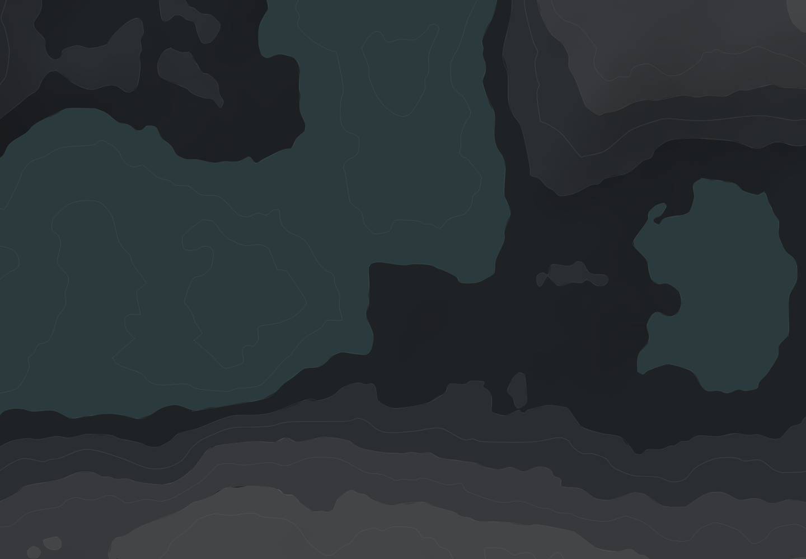

# 舆图 · dsh-isopleth

程序化**地形底纹生成器**：深色地面 + 分级色带（等高面）+ 等高线 + 单向光照 + 水面。
风格取向是工业/科幻测绘界面——疏朗、克制、无装饰性光晕。

零第三方依赖：噪声、marching squares、曲线平滑、山体阴影、PNG 编解码全部自写（仅用 Node 标准库）。


<sub>1440×1000 · 5 级色带 + 单向光照 + 水面 + 9 条等高线 · 全部由 `seed` 决定</sub>

| 2560×1440 | 390×844 | 换 seed（`ridge-07`） |
|---|---|---|
|  |  |  |

> 命名说明：`dsh-isopleth` 取自制图学术语 *isopleth*（等值线）。本项目**不含任何游戏商标**，
> 模块名、类名、包名、SVG 属性里都不会出现「终末地 / Endfield / 明日方舟」。
> 灵感来自工业风测绘界面与分层设色地形图的通用做法，未使用任何游戏素材。

## 三种用法

### 1. 命令行出图

```bash
node steps/step4.mjs                                   # 完整产物 -> out/step4-<seed>/
node steps/step4.mjs --seed ridge-07 --variants 1       # 换 seed + 各档参数对比
node tools/bench.mjs 1600 1000 9 7 5 1                  # 性能基准
```

### 2. 当库用（Node）

```js
import { generateTerrainSvg } from './src/node.mjs';
const { svg, timings, stats } = generateTerrainSvg({ width: 1440, height: 1000, seed: 'isopleth-01' });
```

### 3. 当客户端插件用（浏览器 / 渲染进程，零 Node 依赖）

生成核心是**平台无关**的：PNG 编码器由调用方注入，Node 走 `zlib`、浏览器走 `CompressionStream`。
打包成单文件后可以直接注入渲染进程（形态对齐 `platform-purple/dracula-map.js`）：

```bash
node tools/build-plugin.mjs        # -> dist/dsh-isopleth.plugin.js（15 个模块摊平，约 55 KB，无依赖）
node tools/verify-plugin.mjs       # 真浏览器里验收：加载 / 生成 / 缓存 / 不重算
```

```html
<script src="dist/dsh-isopleth.plugin.js"></script>
<script>
  const plugin = DSH_ISOPLETH.createIsoplethPlugin({ seed: 'isopleth-01', width: 1440, height: 1000 });
  await plugin.apply(document.querySelector('#stage'));   // 挂 background-image
</script>
```

也可以自动挂载：`<div data-isopleth data-seed="ridge-07"></div>` + `DSH_ISOPLETH.autoMount()`。

插件契约：

| 约定 | 实现 |
|---|---|
| 只在初始化时生成一次并缓存 | `apply()` 按 `seed/尺寸/开关` 做 key 缓存；并发调用只算一次（`stats.generations` 可验证） |
| 不每帧重算 | 没有任何 rAF / resize 监听 / 每帧逻辑；换 seed 需显式 `invalidate()` |
| 尊重 `prefers-reduced-motion` | 底纹是静态的；只有显式 `fadeIn: true` 才加过渡，且该媒体查询命中时自动跳过 |
| 不把异常抛给宿主 | `apply()` 返回 `{ok, cached, ms, bytes, error?}`，失败时在元素上留 `data-isopleth-error` |
| 无框架 / 无依赖 | 打包产物 0 个 import，仅用 Web 标准（`CompressionStream` / `matchMedia`） |

> 浏览器与 Node 产出的 SVG **不是逐字节相同**：`CompressionStream` 与 zlib 的 deflate 实现不同，
> 内嵌 PNG 的压缩字节因此略有差异（实测 1440×1000：浏览器 150 KB / Node 154 KB）。几何完全一致。

### 4. 风格层：结构与皮肤分开

生成分两段，可以独立替换：

```
第一段  buildTerrain()   结构 —— 高度场 / 色带几何 / 等高线几何 / 归一化明暗位图
第二段  styleTerrain()   皮肤 —— 底色 / 线色 / 线宽 / 线不透明度 / 明暗强度
```

```bash
node steps/step5-style.mjs --style survey        # 测绘风：中性深底 + 清晰等高线（推荐）
node steps/step5-style.mjs --style spec          # 严格按第 2 节量化表
node steps/step5-style.mjs --style survey-water  # 带十字水系的对照版
```

内置预设（`src/style.mjs`）：

| 预设 | 底色 | 等高线 | 线比底亮 | 水面 |
|---|---|---|---|---|
| `spec` | `#14171a` 偏冷 | `#8ea79a` @14% | +16 | `#2b3a3d` |
| **`survey`** | `#2b2b2b` 中性 | `#6a6a6a` @95% | **+44** | 关 |
| `survey-water` | `#2b2b2b` | `#6a6a6a` @95% + 水系青蓝 | +45 | `#2f3c44` |

`survey` 的取值是从风格参考图里**只提取地纹语言**反推的（参考图实测：底色 `#313131`、线 `#5e5f5f`、
线比底亮 +46）。参考图里的白色地图块、青蓝水系、黄色状态高亮都是游戏内容，不属地纹语言，一律没有抄。

## 输入参数（都有默认值）

| 参数 | 默认 | 说明 |
|---|---|---|
| `seed` | `isopleth-01` | 任意字符串；换成 `ridge-07` 地形完全不同 |
| `width` / `height` | 1440 / 1000 | 任意宽高比 |
| `levels` | 9 条（0.1…0.9） | 等高线条数 |
| `bands.bandCount` | 5 | 色带级数（5~7），边界自动吸附到等高线层级 |
| `bands.lightenStep` | 0.05 | 每级白叠加 3%~5% |
| `lighting` | 开 | `{ azimuthDeg: 315, altitudeDeg: 45, gradientRadiusPx: 60, relief: 260, shadowAlpha: 0.28, lightAlpha: 0 }` |
| `water` | 开 | `{ level: 0.3 }`，颜色 `#2b3a3d` |
| `field` | — | fBm 参数：`octaves 6 / gain 0.42 / baseWavelength 560 / contrast 1.5 / step 3 / pad 64` |

## 产物规模与性能（实测）

| 尺寸 | SVG | 生成耗时（全套） |
|---|---|---|
| 1440×1000 | 149 KB | 282 ms |
| 2560×1440 | 349 KB | 345 ms |
| 390×844 | 39 KB | 62 ms |
| **1600×1000（规格目标）** | **154 KB** | **139 ms**（7 次中位，预热后，最慢 187 ms） |

预算 300ms，余量约 2.2×。生成是**纯函数**：同参数必得同一 SVG，常驻插件只需初始化算一次并缓存，不含每帧逻辑。
无任何动画，`prefers-reduced-motion` 天然满足。

## 规格自查（禁止项）

| 禁止项 | 状态 |
|---|---|
| 平铺 / 重复贴图 / 可见接缝 | 世界坐标连续采样，无取模、无重复；相邻色带共用同一条曲线，接缝被等高线压住 |
| 同一几何缩放叠加（摩尔纹） | 不存在任何缩放叠加图层 |
| 未覆盖区域 | `ground` 矩形覆盖整个 viewBox，三尺寸实测覆盖 == 视口 |
| 游戏商标 | 模块名 / 类名 / 包名 / SVG 属性中均无 |
| 规格外视觉元素 | 无光晕、无噪点、无外发光、无渐变按钮；明暗只有一束平行光，无光斑（迎光提亮默认关闭） |

## 目录

```
src/noise.mjs      自写 2D 值噪声 + fBm
src/field.mjs      世界坐标采样格 + 确定性取景
src/marching.mjs   marching squares：等值线 + 区域掩膜多边形
src/simplify.mjs   Douglas-Peucker
src/smooth.mjs     Catmull-Rom → 三次贝塞尔
src/bands.mjs      分级色带
src/hillshade.mjs  单向光照（只算 RGBA，不负责编码）
src/water.mjs      水面
src/svg.mjs        SVG 组装
src/png.mjs        平台无关 PNG 组装（deflate 由调用方注入）
src/generate.mjs   生成核心：buildTerrain / renderSvg（浏览器安全，零宿主 API）
src/node.mjs       Node 入口：注入 zlib 同步编码器
src/browser.mjs    浏览器入口：注入 CompressionStream 异步编码器
src/index.mjs      公开 API
plugin/entry.mjs   客户端插件（缓存 / reduced-motion / 错误不外抛）
dist/              打包产物：单文件插件
steps/             各步骤 CLI
examples/          插件演示页
tools/             自写 PNG 编解码、光栅化、打包器、基准与各类验收探针
```

产物：CLI 出图在 `out/step4-<seed>/`（`terrain-<WxH>.svg` 交付物、`.png` / `@2x.png` 预览、
`crop1to1-<WxH>.png` 1:1 原生像素裁切、`out/step4-report-<seed>.json` 全部实测值）。
